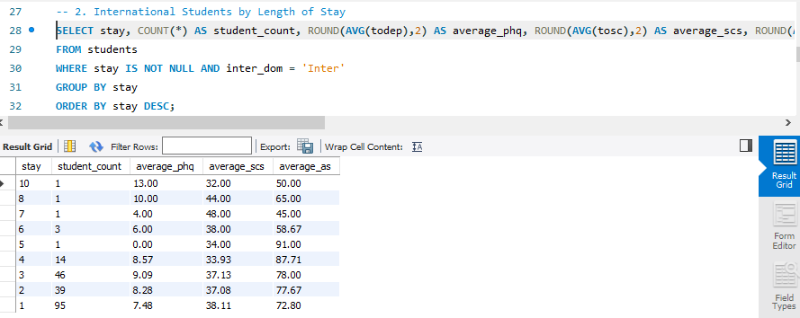
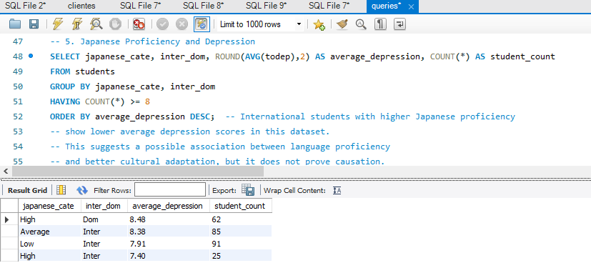
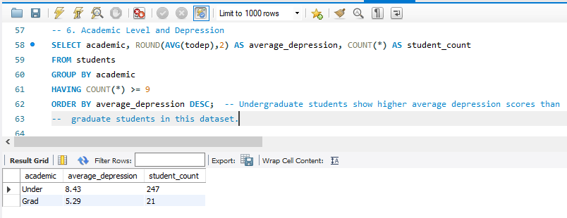

# 📊 Student Mental Health Analysis


## Project Overview

This project explores the relationship between mental health and different demographic and academic factors among university students in Japan using SQL.

The original dataset comes from a DataCamp SQL project based on a real-world study that investigated depression, social connectedness, and acculturative stress among domestic and international students.

Beyond the original project requirements, I performed additional exploratory analyses to identify potential relationships between depression scores and variables such as age, academic level, student type, and Japanese language proficiency.

---

## Dataset

The dataset contains survey responses from university students in Japan and includes demographic, academic, and psychological information.

### Main Variables

- Student Type (Domestic / International)
- Age
- Length of Stay
- Academic Level
- Japanese Language Proficiency
- Depression Score (PHQ-9)
- Social Connectedness Score (SCS)
- Acculturative Stress Score (ASISS)

---

## Objectives

The goal of this project was to answer questions such as:

- Does the length of stay affect mental health?
- Does age influence depression?
- Are international students more affected than domestic students?
- Does Japanese language proficiency relate to depression?
- Does academic level influence depression scores?

---

## Tools Used

- MySQL
- MySQL Workbench
- SQL
- GitHub

---

## SQL Skills Demonstrated

- Data Exploration
- Filtering with WHERE
- GROUP BY
- HAVING
- Aggregate Functions
- COUNT()
- AVG()
- ROUND()
- ORDER BY
- Exploratory Data Analysis (EDA)

---

## Analysis Performed

The analysis included:

- Initial exploration of the dataset
- Comparison between domestic and international students
- Depression analysis by age
- Depression analysis by academic level
- Japanese language proficiency analysis
- Mental health trends by length of stay
- Interpretation of the findings using SQL queries

---
## Project Preview

### Length of Stay Analysis



This query analyzes how the length of stay in Japan relates to depression, social connectedness, and acculturative stress among international students.

### Japanese Proficiency Analysis



Students with higher Japanese language proficiency tend to show lower average depression scores in this dataset.

### Academic Level Analysis



Undergraduate students present higher average depression scores than graduate students in this dataset.

## Key Findings

- International students with higher Japanese language proficiency showed lower average depression scores.
- No clear relationship was found between age and depression among international students.
- Domestic students presented slightly higher average depression scores than international students, although the difference was relatively small.
- Undergraduate students showed higher average depression scores than graduate students.
- Length of stay appears to be associated with differences in mental health indicators among international students.

> **Note:** These findings describe associations observed in the dataset and should not be interpreted as evidence of causation.

---

## Repository Structure

## Repository Structure

```
student-mental-health-analysis
│
├── data
│   └── students.csv
│
├── images
│   ├── mentalhealth.jpg
│   ├── dataset_preview.png
│   ├── stay_analysis.png
│   ├── japanese_analysis.png
│   └── academic_analysis.png
│
├── mental_health_analysis.ipynb
├── queries.sql
└── README.md
```

---

## How to Run

1. Download the repository.
2. Import the `students.csv` dataset into MySQL.
3. Open `queries.sql` in MySQL Workbench.
4. Execute the queries to reproduce the analysis.

---

## Future Improvements

Potential next steps for this project include:

- Building interactive dashboards in Power BI or Tableau.
- Performing statistical hypothesis testing.
- Creating visualizations using Python (Matplotlib/Seaborn).
- Developing predictive models for depression risk.

---

## About Me

**Alvaro Perez**

Mechanical Engineer transitioning into Data Analytics.

Currently building a portfolio focused on:

- SQL
- Python
- Data Analysis
- Power BI
- Machine Learning

GitHub:
https://github.com/alvaroperez1804
